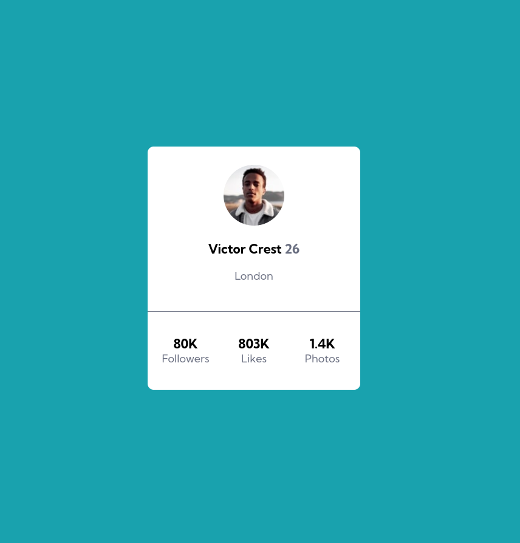

# Exercício 01 | Cartão de perfil

## aplicando tecnicas de display flex

Como foi o primeiro exercício criado tive algumas dificuldades no início mas após ir criando o projeto já fui pegando a "manha"

### link para acesso:

https://lucasramosfs.github.io/projeto02-frontend-mentor-cartao-perfil/

